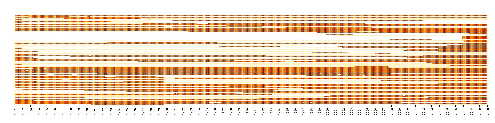

# Series of scripts to handle CHMI daily climate historical data
  
https://www.chmi.cz/historicka-data/pocasi/denni-data/Denni-data-dle-z.-123-1998-Sb CHMI daily climatic data are currently available from 1961 to 2021 but with many missing data.
  
### 1. Downloading script
[Downloading script.R](./downloading_script.R) will download all available csv files. In 2021 it was 6 382 csv files covering 11 elements. 

### 2. Unzip and process data
[unzip_process.R](./unzip_process.R) will unzip all downloaded files. There is also an example provided for processing daily mean air temperature into single, flat table, where rows are days and columns station IDs. You can easily modify thy example with changing element code for any other element. Currently there are available:

| climatic element                 |code  | number of stations with data |
|----------------------------------|------|------------------------------|
| Daily mean relative air humidity |H_N   | 411                          |
| Sum of daily precipitation       |SRA_N | 1253                         |
| Daily mean air pressure          |P_N   | 69                           |
| Total depth of snow              |SCE_N | 1168                         |
| Depth of daily fresh snow        |SNO_N | 1149                         |
| Daily duration of sun shining    |SSV_N | 234                          |
| Daily mean air temperature       |T_N   | 501                          |
| Daily maximal air temperature    |TMA_N | 466                          |
| Daily minimal air temperature    |TMI_N | 467                          |
| Daily mean  wind speed           |F_N   | 385                          |
| Daily maximal wind speed         |Fmax_N| 189                          |

### Missing values
There are a lot of missing data, individual station varies in logging period. The oldest data comes from 1. 1. 1961 and the newest from 31. 12. 2021. Almost none station measured continuously for whole period. Typically, the data cover only part of the time period from 1961 till 2021.    
Y axis shows stations, X axis time.

### Changing station location through time
Many stations were moved in last 61 years, some of them were moved several times. In the table [coords_time.csv](./coords_time.csv) coordinates are provided together with the time. In case the station was moved, there is new line with station id and time span the station was located at the certain coordinates. There is also [GIS file](./coords_time.gpkg)  identical with csv table. The table with station coordinates was produced in [poloha_stanic_merge.R](./poloha_stanic_merge.R) script. At the end of the script, there is example how to get the last known coordinates for selected element.   

