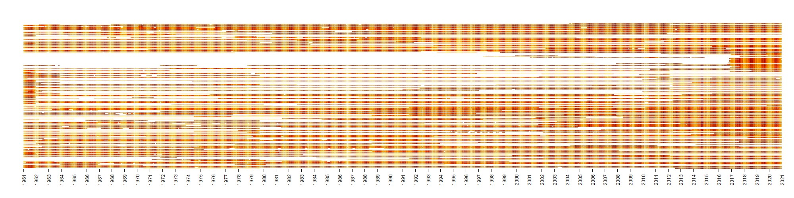

# Series of scripts to handle CHMI daily climate historical data
  
CHMI daily climatic data are currently available from 1961 to 2020 but with many missing data.
  
### 1. Downloading script
https://www.chmi.cz/historicka-data/pocasi/denni-data/Denni-data-dle-z.-123-1998-Sb
To run [Downloading script.R](./Downloading script.R), you need stations ID. By default I prepared table with the IDs [stanice_kraje_ids.csv](./stanice_kraje_ids.csv). In script [poloha_stanic_merge.R](./poloha_stanic_merge.R) you can check Where the station IDs comes from. You can process station IDs yourself or use default. Default will download (I hope) all data. Providing subset of station IDs you can decide which data download specifically. Downloading process result is bunch of zip files on your drive. 

### 2. Unzip and process data
[Downloading script.R](./Downloading script.R) will unzip downloaded files and  produce table where rows are days and columns station IDs. Only mean air temperature is provided as an example. You can easily modify for any other variable specifying variable name. Currently there are available:

| climatic element                 | number of stations with data |
|----------------------------------|------------------------------|
| Daily mean relative air humidity | 273                          |
| Sum of daily precipitation       | 718                          |
| Daily mean air pressure          | 57                           |
| Total depth of snow              | 707                          |
| Daily duration of sun shining    | 186                          |
| Daily mean air temperature       | 296                          |
| Daily maximal air temperature    | 279                          |
| Daily minimal air temperature    | 279                          |
| Daily mean  wind speed           | 250                          |

For the list of stations with or without data available for specific element you can check the table: [stanice_data.csv](./stanice_data.csv) or the QGIS file [stanice_data.gpkg](./stanice_data.gpkg) 

### Missing values
There are a lot of missing data, individual station vary in logging period. The oldest data comes from 1. 1. 1961 and the newest from 31. 12. 2020. Almost none station mesured continunously for that period.   
Y axis shows stations, X axis time. 

### Station position
This script build upon Oto Kalab’s one, you can find here https://github.com/kalab-oto/chmu-poloha-stanic Use this script to merge into single file and filter duplicates. The output is also in this repository. You can simply download to proceed with downloading data. (stanice_ids.csv)

### Various staion location in time
In scripts [poloha_stanic_merge.R](./poloha_stanic_merge.R)I ignored variable position of measuring point in time. Inside raw CSV files downaloaded from CHMI, there are additional metadata like precise coordinates of measuring device in time. My scripts ignores it and simply merge all data by station ID and current position, ignoring spatial shift in time. 
